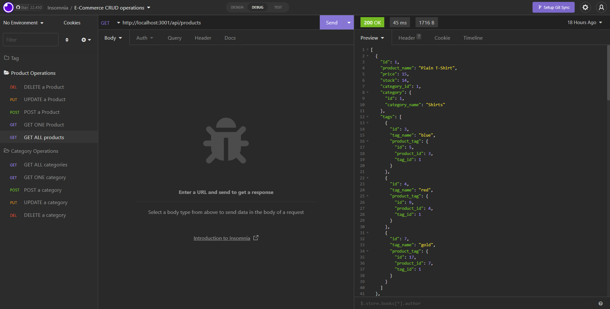

 # ORM E-Commerce Back End

  [](https://opensource.org/licenses/MIT)

  ## Description

  With the ever growing need for E-commerce websites, it is imperative to have the skill and knowledge in not only the client side webpage but also the 'Engine' we call the 'back end'. This application demonstrates the fundamental skills in back-end server API. With the use of Node Express routing in conjuction with database technology, we can provide the client's webpage with more dynamic functionality.

  ## Table of Contents

  - [Installation](#installation)
  - [Usage](#usage)
  - [Contributing](#contributing)
  - [Tests](#tests)
  - [Questions](#questions)
  - [License](#license)

  ## Installation

  This application utilizes MySQL to store data, here is the [link](https://dev.mysql.com/downloads/installer/) to install the database technology. Please follow a guide on how to install it correctly. To check routing and API data retrieval, we use the Insomnia app. Here is the [link](https://insomnia.rest/download) to install it. 

  To start this application, you must install the packages first. Simply type in 
  ```
  $ npm install
  ```
  and it will install all the packages within the package.json file. We will be utilizing `dotenv`, `express`, `mysql2`, `sequalize`, and `nodemon`. Once the packages are installed, we must now enter the credentials to connect to the MySQL database. In the Develop folder, there is a file called `.env.EXAMPLE` which holds the environmental variables. You can copy the file or rename the file to `.env`. In the file it will have the following and you must type in the information:
  ```
  DB_NAME='ecommerce_db' //this is the name of the database this app uses
  DB_USER='root'
  DB_PW= *Your MySQL password*
  ```
  Once that is all set up, you are now able to connect to the database through the app. 


  ## Usage

  In order for us to see the functionality of this application, we use `Insomnia`. Insomnia will show us the data retrieved from the database using the specific CRUD operations. The following shows the `GET` operation (right hand side) performing a request to get all the data from the products table (left hand side). 

  

  We can view each of the CRUD operations to check the functionality of this application. 

  ## Contributing

  If you would like to contribute, please clone the repository and create a pull request to me or contact me. Thank you. 

  ## Tests 

  In the Develop folder, there is another folder called `seeds` which will populate our database with data. We can use those data to test our server API. Below is a walkthrough video which will show not only the functionality of the app but also the steps to get this app running.

  ## Questions

  GitHub profile: [https://github.com/DKhubgit](https://github.com/DKhubgit)

  Email me at - danielkang13@gmail.com - if you have questions!

  ## License

  Copyright (c) 2022 , Daniel Kang
  
  All rights reserved.

  Licensed under the [MIT license](https://opensource.org/licenses/MIT) License.